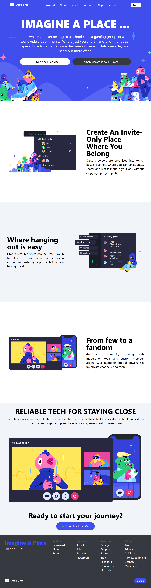
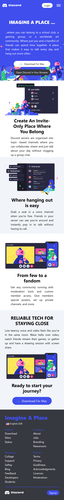
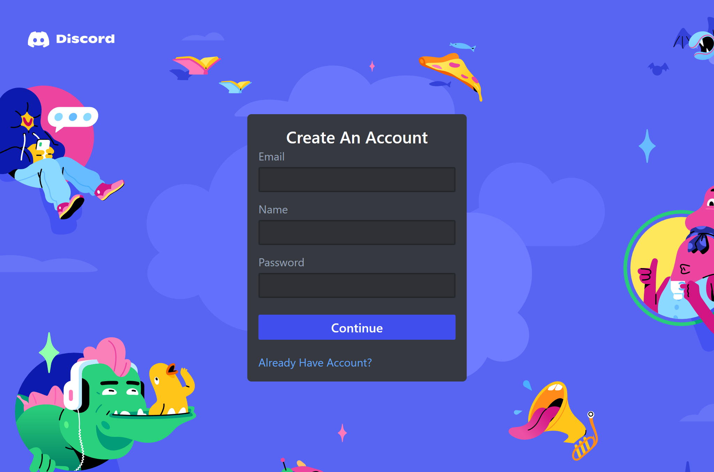
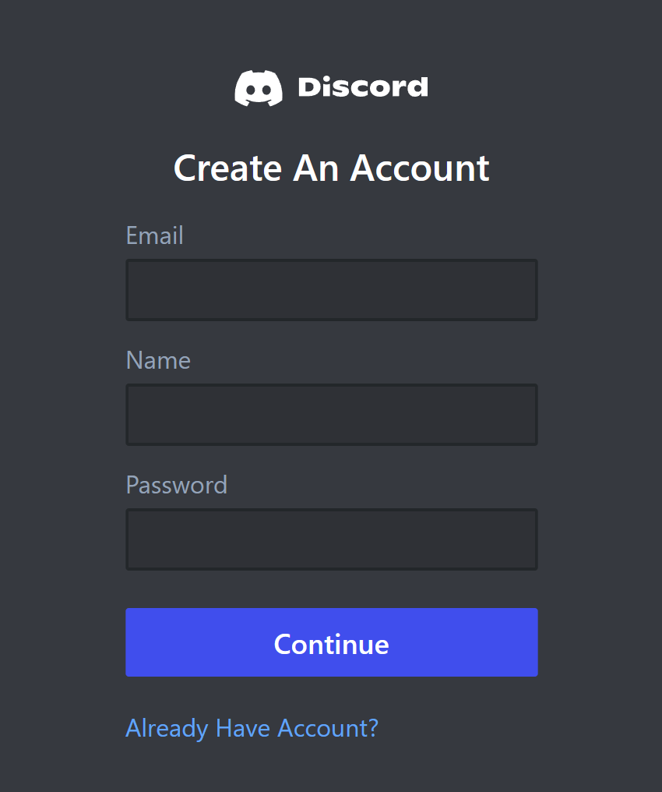
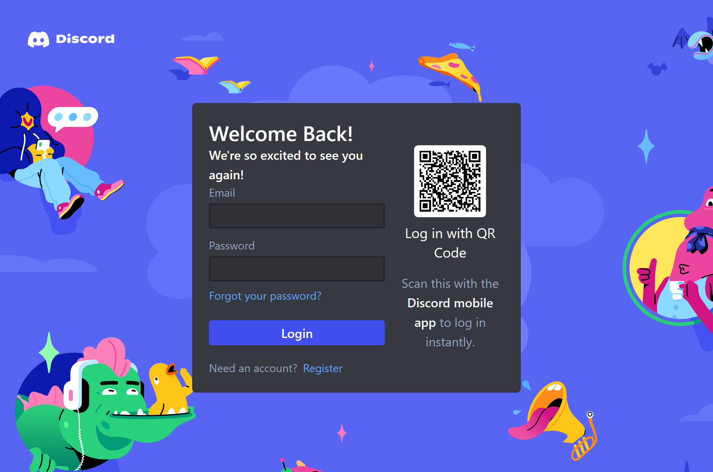
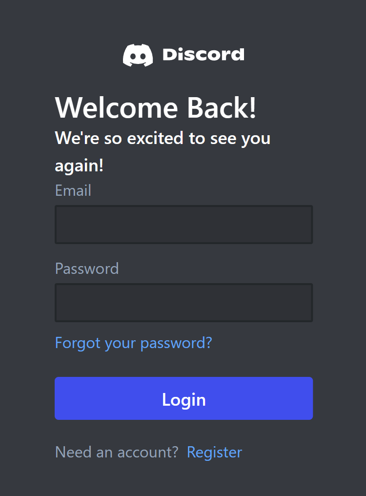
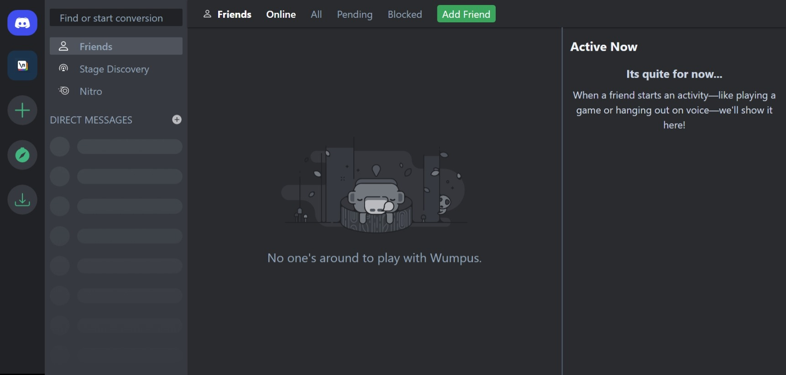
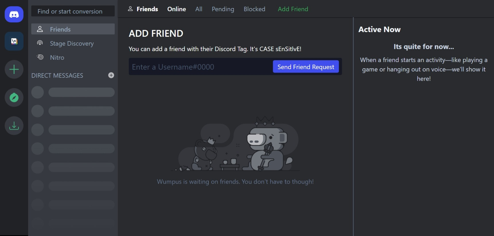
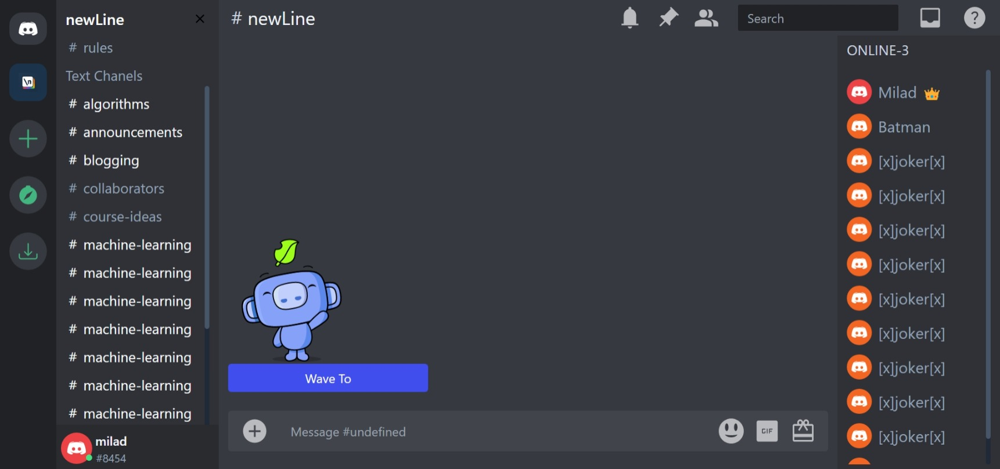

#  Discord UI Clone Built Using React

### An functional discord UI clone

## Screenshots

### Landing page

    
    &ensp; &ensp;

    
    &ensp; &ensp;

### Signup page

    
    &ensp; &ensp;

    
    &ensp; &ensp;

### Signin page

    
    &ensp; &ensp;

    
    &ensp; &ensp;

### dashboard page

### dashboard/addfriend page

### dashboard/server/newline page

